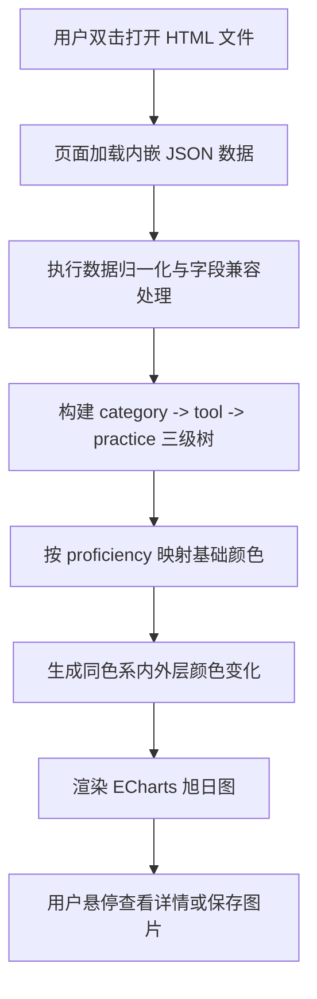

## 1. 产品概述
基于用户提供的 JSON 数据，生成一个可直接双击运行的单文件 HTML 页面，用 ECharts 绘制三层同心旭日图（轮盘样式）。
- 页面用于展示“工具大类 -> 具体工具 -> 工作实践场景”的层级关系，并通过熟练度映射颜色，适合汇报、打印和嵌入 PPT。
- 产品价值在于将结构化能力画像快速可视化，兼顾展示效果、可读性与零门槛交付。

## 2. 核心功能

### 2.1 功能模块
1. **数据加载模块**：接收内嵌 JSON 数据并做基础格式归一化。
2. **旭日图渲染模块**：将三级层级数据转换为 ECharts `sunburst` 所需结构并渲染。
3. **视觉映射模块**：根据 `proficiency` 字段映射颜色，并向内外层延展同色系深浅变化。
4. **交互模块**：支持鼠标悬停提示、右上角导出图片、窗口自适应缩放。

### 2.2 页面详情
| 页面名称 | 模块名称 | 功能描述 |
|-----------|-------------|---------------------|
| 旭日图单页 | 页面标题区 | 展示图表名称与简要说明，适合直接演示与截图 |
| 旭日图单页 | 数据解析区 | 兼容数组或对象包裹数组的 JSON 输入结构 |
| 旭日图单页 | 图表主区域 | 展示三层同心旭日图，保证正圆、环间距适中、标签清晰 |
| 旭日图单页 | 悬停提示 | 显示当前节点名称、层级路径、熟练度和值 |
| 旭日图单页 | 工具栏 | 提供内置保存图片按钮，导出白底高清图片 |

## 3. 核心流程
用户打开 HTML 文件后，页面自动加载内嵌 JSON，完成数据归一化、层级树构建、颜色映射和旭日图渲染；用户可鼠标悬停查看详情，也可直接保存图片用于 PPT 或打印。

## 4. 用户界面设计
### 4.1 设计风格
- 主色为白底配深色文字，强调干净、专业、适合打印
- 图表颜色采用深绿、浅黄、浅灰三组能力色
- 字体使用微软雅黑优先，兼容中文办公环境
- 布局采用单页居中展示，突出轮盘主视觉
- 控件风格简洁，不做多余装饰，强调 PPT 友好

### 4.2 页面设计概览
| 页面名称 | 模块名称 | UI 元素 |
|-----------|-------------|-------------|
| 旭日图单页 | 顶部标题 | 页面标题、副标题、留白清晰 |
| 旭日图单页 | 图表容器 | 大尺寸正圆图表区域、圆角容器、白底 |
| 旭日图单页 | 标签系统 | 径向文字、分层字号、避免过度拥挤 |
| 旭日图单页 | 提示框 | 白底浅边框、中文信息说明、可打印友好 |

### 4.3 响应式
采用桌面优先设计，同时支持浏览器窗口缩放自适应；打印场景下保持白底与较大可视尺寸。
