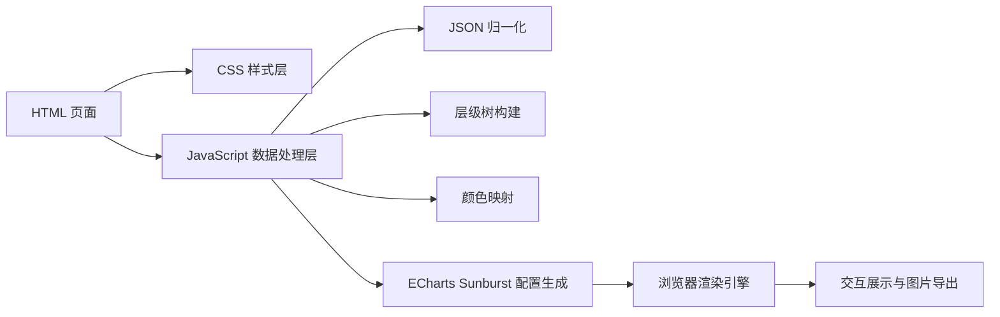
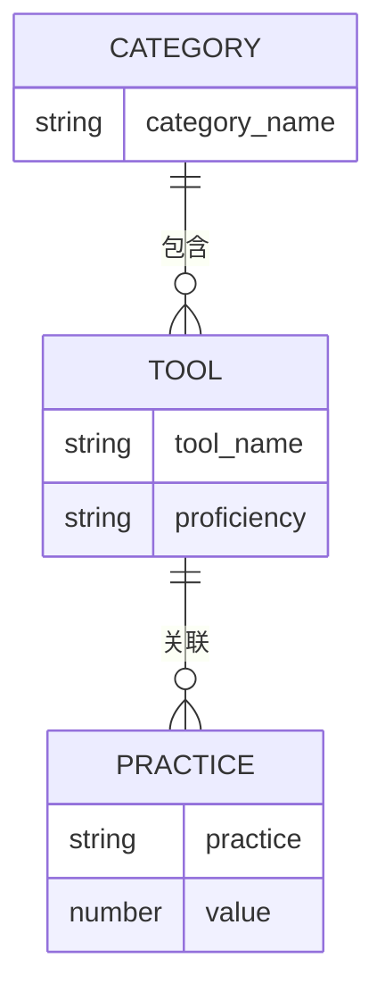

## 1. 架构设计

本方案采用纯前端单文件架构，不引入构建工具、不依赖后端服务，直接通过 CDN 加载 ECharts 并在浏览器中运行。

## 2. 技术说明

* 前端：原生 HTML5 + CSS3 + JavaScript ES2020

* 图表库：ECharts 5.x CDN 版本

* 数据输入：页面内嵌 JSON 常量

* 运行方式：本地双击打开 HTML 文件，无需 Node、打包器或服务器

## 3. 路由定义

| 路由      | 用途                  |
| ------- | ------------------- |
| `本地单文件` | 打开后直接显示旭日图页面，无多路由结构 |

## 4. API 定义

本页面为纯静态可视化页面，不包含后端 API。

## 5. 数据模型

### 5.1 数据模型定义

### 5.2 输入 JSON 字段约定

| 字段名             | 类型     | 说明                            |
| --------------- | ------ | ----------------------------- |
| `category_name` | string | 工具大类，最内层圆环                    |
| `tool_name`     | string | 具体工具名称，中间层圆环                  |
| `practice`      | string | 工作实践场景，最外层圆环                  |
| `proficiency`   | string | 熟练度，取值为 `high`、`medium`、`low` |
| `value`         | number | 可选权重，未提供时默认值为 1               |

## 6. 渲染策略

* 使用 `sunburst` 系列实现三层同心结构

* 使用 `levels` 明确定义每层半径区间，保证轮盘正圆且留白适中

* 中间层工具节点使用 `proficiency` 基础色

* 内层分类节点使用对应主导熟练度颜色的略深版本

* 外层实践节点使用对应工具颜色的略浅版本

* 标签采用 `rotate: "radial"` 以实现径向排布

* `toolbox.saveAsImage` 提供右上角导图能力

* `tooltip.formatter` 展示中文详情信息

## 7. 异常与兼容处理

* 兼容数组输入与 `{ data: [...] }`、`{ list: [...] }` 包裹输入

* 对缺失字段做兜底命名，避免图表报错

* 对未知 `proficiency` 默认降级为 `low`

* 浏览器窗口变化时触发 `chart.resize()`

